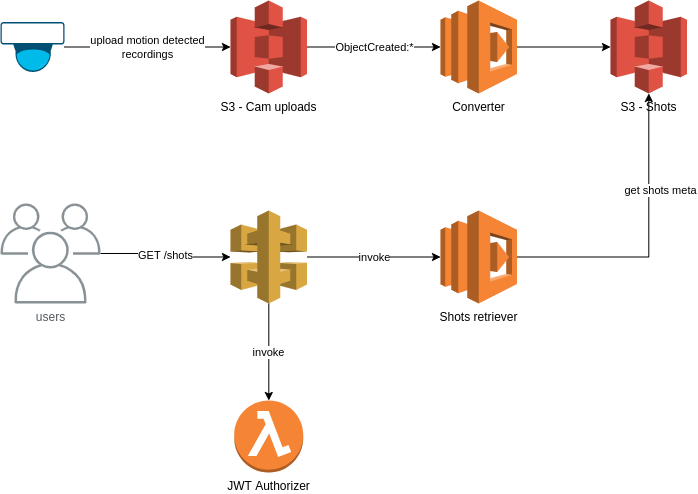

# Shots Recorder

I bought IP cameras to observe my cats. I just didn't like the cloud connection and the access to the camera directly to view recordings (here triggered by motion) is also not very user-friendly. The recordings are in AVI format and therefore not directly viewable in the browser. 

The goal of the project is that the recordings are automatically uploaded from the camera to the cloud, where they are converted into a browser-friendly format, such as MP4. The recordings can then be displayed via a web application. The solution is implemented via a serverless architecture in the AWS Cloud. Roughly, the following steps are necessary for this:
- Automatic uploading of the camera recordings (AVI) into an S3 bucket (configuration).
- Converting the AVI recording to MP4 and storing it in another S3 bucket
- Provide a Restful API to retrieve the recordings
- Displaying the recordings in a web application

## Functions

### Converter
The [Converter](converter) function basically converts avi files to mp4 files using [ffmpeg](https://ffmpeg.org/). I used a lambda layer to make ffmpeg available to the function. See [layer function](ffmpeg) and serverless [configuration](serverless.yml) for details.

### Shots Retriever

This [function](shots-retreiver) returns a list of metadata for all available shots.   The endpoint is published via the AWS API gateway and secured via a JWT Authorizer. For example, I use Auth0 as the identity provider. The configuration is stored in the parameter store. See serverless [configuration](serverless.yml) for details. 
